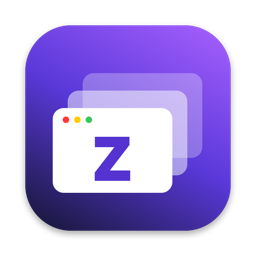

# Zuvi Tab



A Windows-style Alt+Tab window switcher for macOS, built privacy-first.

## Keys

Default is **Command+Tab**, replacing the macOS app switcher. It needs Accessibility; until that is granted the app
falls back to **Option+Tab**, and switches over automatically once it is. Toggle this in the menu bar.

| Keys (Command mode) | Action |
|---|---|
| Cmd+Tab | Open switcher, next window. Quick tap jumps to the previous window with no UI. |
| Cmd+Shift+Tab | Previous window |
| Cmd+Arrows, Cmd+` | Move selection |
| Release Cmd / Cmd+Return / click | Switch to selected window |
| Cmd+Esc | Cancel |
| Cmd+F while open | Search by title or app name; the switcher stays open, Return picks, Esc cancels |
| W / M / Q / H while open | Close window / minimize / quit app / hide app |
| Hover a tile | Close, minimize, and quit buttons appear |

Optional, from the menu bar: **Sticky mode** keeps the switcher open after you release the key (type to search, Return picks, Esc cancels), and **Bring windows from other desktops here** moves a picked window to your current desktop instead of jumping to it. It never moves windows into or out of full screen.

### Desktops

One switcher covers desktops too. Windows on other desktops and full-screen apps are in the same grid, and picking one
takes you there. Empty desktops appear as wallpaper tiles in the same grid, placed by when you last used them, so the
desktop you just left comes right back up, and Tab reaches them like any window. They are reached with macOS's own Control+Arrow "Move a space" shortcuts, so keep those enabled
in Keyboard Shortcuts > Mission Control. Turn them off with **Include empty desktops** in the menu.

The menu option **Only show windows on the current desktop** matches Windows' "Show windows open on: only the desktop I'm using".

In Option mode the same keys work with Option, plus Option+` to cycle the current app's windows.

With previews on, the selected window also gets a full-size "peek" preview in place, like Windows.

Windows are ordered most-recently-used, like Windows, using live focus notifications from each app (window numbers only). Minimized windows come last and are restored when picked.

## Live preview

Flick through quickly and nothing changes. Rest on a window for a second and its preview goes live: a video, a call,
a progress bar or a music visualizer keeps moving in the tile and in the full-size peek behind the switcher, even for
windows on other desktops. Only that one window is streamed, only while the switcher is open, and it stops the moment
you move on. Change the delay (or turn it off) under **Live preview when resting on a window** in the menu.
Apps that pause drawing when they're hidden (some browsers do this for background tabs) will show their last frame.

### Bring window forward when resting

Optional (menu: **Bring window forward when resting**). Instead of a preview, resting on a tile brings the real window
forward behind the switcher, switching desktops if needed. This makes even apps that stop drawing when hidden, such as
browsers, truly live. Release to stay there, keep tabbing to peek at others, or press Esc to go back to exactly where
you started. Peeks don't change the recent-first order; only the window you end up on counts.

## Look

On macOS 26 and later the switcher is real Liquid Glass and follows your system exactly: light or dark mode, and the
Clear or Tinted glass setting in System Settings > Appearance. macOS only reads that setting when an app starts, so
Zuvi Tab restarts itself quietly when you change it (never while the switcher is open). On older macOS it uses the
classic dark frosted panel.

## Privacy model

- **No network code.** `build.sh` fails if networking symbols appear in the binary.
- **Nothing on disk** but menu preferences (`defaults read com.zuvitab.ZuviTab`). Titles and MRU order are in memory only.
- **Keyboard access is minimal.** Option mode uses Carbon `RegisterEventHotKey`, which needs no permission and never sees other keystrokes. Command mode must use an event tap, because macOS reserves Cmd+Tab. The tap reads only key codes while Command is held, never typed characters, and stores nothing.
- **Other-Space windows need no extra permission.** Their titles are shown only if Screen Recording is already granted; otherwise just the app name.
- **Tiered permissions.** None: switches apps (Option+Tab). Accessibility: lists and raises individual windows and enables Command+Tab. Screen Recording: previews (on by default; turn off with **Window previews** in the menu and the permission is never needed).
- **Respects capture opt-outs.** Windows whose app asks macOS not to be captured, such as banking apps, password managers, and protected video, are never previewed and show a lock.
- **Live preview is opt-in by pause.** Only the window you rest on is streamed, only while the switcher is open; frames are shown and never stored, and macOS shows its screen-capture indicator while it runs.
- **Previews only while open.** Tiles and the peek preview are captured when the switcher opens and dropped when it closes. While open, windows on the current desktop refresh every 1.5 seconds. There is no background capture and nothing is cached between uses, unlike AltTab and Switch.
- **Never-preview list.** Password managers are excluded by default. Their titles are masked and they are never captured. Add any app from the menu bar.
- **Private windows masked** when the browser puts a marker like "Private Browsing" or "Incognito" in the title. This is best-effort.
- **Hidden from screen sharing.** The switcher window uses `sharingType = .none`, so it never appears in screenshots, recordings, or calls.

## Build

```
./build.sh
```

Runs on macOS 14 or later. Building needs the macOS 26 SDK or newer (current Xcode command-line tools:
`xcode-select --install`), because the Liquid Glass look uses macOS 26 APIs. Installs to `~/Applications/Zuvi Tab.app`.
`scripts/check-no-network.sh` runs on every build and in CI, and fails if any networking API appears in the binary.

If a code-signing certificate named "Zuvi Tab Local Signing" is in your login keychain, the build is signed with it and
macOS keeps the Accessibility and Screen Recording permissions across rebuilds. Without one the app is ad-hoc signed and
you re-grant those permissions after each build.

The icon is drawn in code: `swift tools/make-icon.swift` regenerates `Resources/AppIcon.icns`.

Window focusing uses the same private window-server calls as AltTab and yabai for exact, cross-desktop focus. They are
loaded at runtime; if macOS ever removes them the app falls back to the public Accessibility API.

## Known limits

- Picking a window on another Space switches to that Space; if the app has several windows there, macOS may briefly show a different one before the right window is raised.
- Command mode stops working inside secure text fields such as password boxes, where macOS blocks keyboard filters. The native switcher takes over there.
- Private-window detection depends on the browser exposing it in the window title.
- With thumbnails on, macOS may periodically ask you to reconfirm Screen Recording access.
- Still previews of windows on other Spaces show their last drawn contents, which can be slightly out of date. Live preview streams them, but apps that stop drawing hidden windows (browsers, for example) freeze on their last frame; **Bring window forward when resting** works around that.
- Jumping to an empty desktop on a second display can move the wrong display's Spaces.

## Credits

Window discovery and exact cross-desktop focusing use techniques pioneered by [AltTab](https://github.com/lwouis/alt-tab-macos)
and [yabai](https://github.com/koekeishiya/yabai). Ideas such as respecting capture opt-outs and live focus tracking were
inspired by [Switch](https://github.com/Sanyam-G/switch). No code was copied from these projects.

## License

MIT, see [LICENSE](LICENSE).
